# User-Group-Manager

## Project Overview

User-Group-Manager is a Bash-based script designed for managing users and groups on a Linux-based system. It utilizes an easy-to-use menu interface powered by `whiptail` for interactive user management tasks. The project includes features such as adding, deleting, modifying users and groups, as well as enabling/disabling accounts, all while logging actions for auditing.

## Features

- **Add User**: Add a new user to the system.
- **Delete User**: Remove an existing user and their home directory.
- **Modify User**: Modify an existing user's username.
- **List Users**: List all normal users on the system.
- **List User Details**: Get detailed information about a specific user.
- **Add Group**: Add a new group.
- **Modify Group**: Modify an existing group and its members.
- **List Groups**: List all groups on the system.
- **Enable User**: Unlock a user account.
- **Disable User**: Lock a user account.
- **Delete Group**: Remove a group from the system.
- **Change Password**: Change a user's password.
- **Exit**: Exit menu.
## Project Structure

user-group-manager/
├── menu              # Main script to launch the interactive menu
├── functions         # Contains all the core functions for user/group management
├── install           # Script to install necessary dependencies
├── logs/             # Directory for storing log files
├── screenshots/      # Directory for storing screenshots for documentation
└── README.md         # Project documentation


## Installation

To get started with User-Group-Manager, follow the installation steps below.

1. **Clone the repository**:
    ```bash
    git clone https://github.com/elhamhassan90/user-group-manager.git
    cd user-group-manager
    ```

2. **Run the installation script**:
    ```bash
    bash install
    ```

This will install all the necessary dependencies and ensure the script works properly on your system.

## Usage

Once the installation is complete, you can execute the script as follows:

1. **Run the script**:
    ```bash
    bash menu
    ```

2. The script will present a menu with various options for managing users and groups.

## Logging

All actions performed using the script will be logged to the `logs/` directory for auditing purposes. Each log entry includes details about the action taken, such as the username/group, timestamp, and the action performed (e.g., user added, user deleted, etc.).

Logs can be viewed using the following command:

```bash
cat logs/user-group-manager.log


## 📸 Screenshots
./screenshots/12logs.PNG

(./screenshots/main.png)

## 📷 Included Screenshots
## 📷 Screenshots
### 🔹 NGINX Reverse Proxy in AZ1 serving Apache content from Private EC2
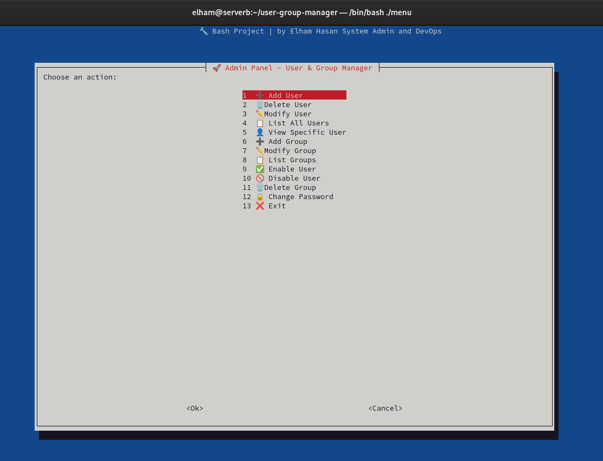
### 🔹 1. Main Menu:


### 🔹 2. Add User:
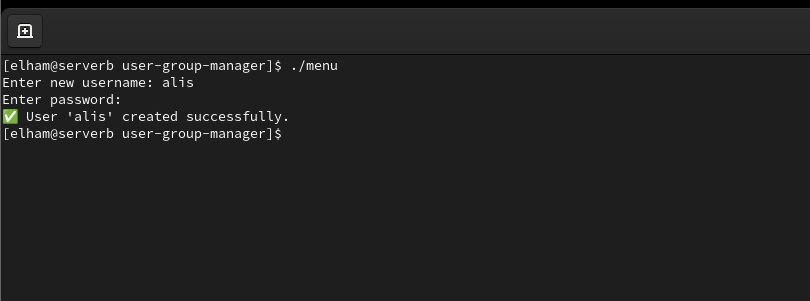

### 🔹 3. Delete User:
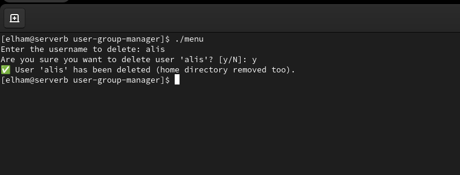

### 🔹 4. Modify User:
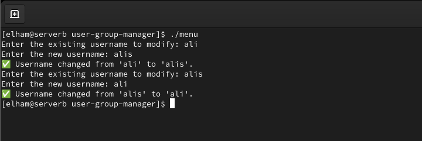

### 🔹 5. List Users:
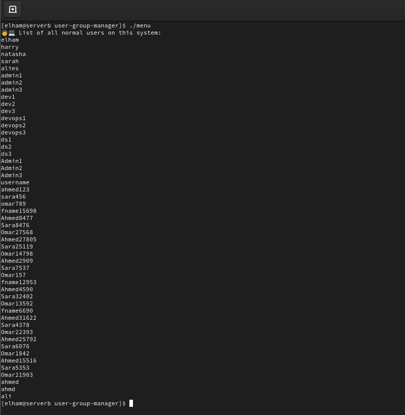

### 🔹 6. List a User and Groups:
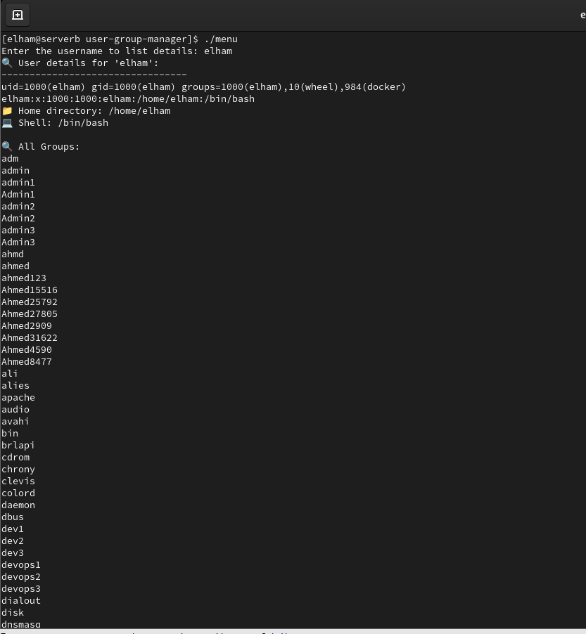

### 🔹 7. Add & Modify a Group:
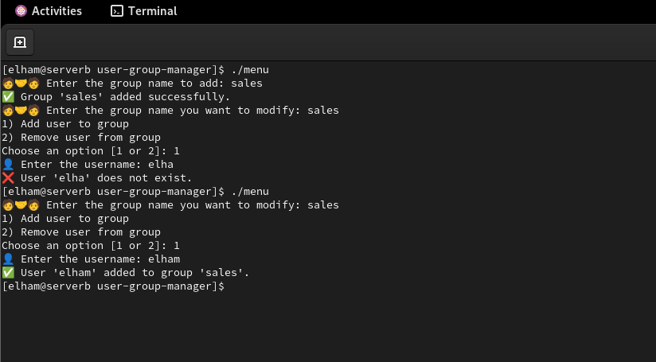

### 🔹 8. Enable & Disable a User:
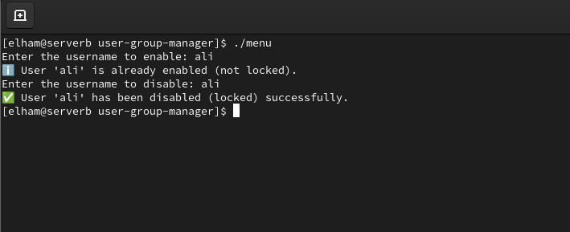

### 🔹 9. Delete Group:
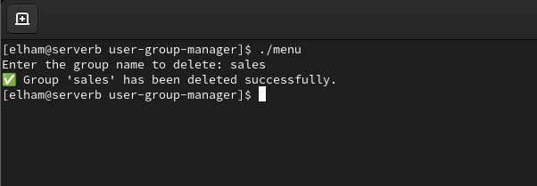

### 🔹 10. Change Password:
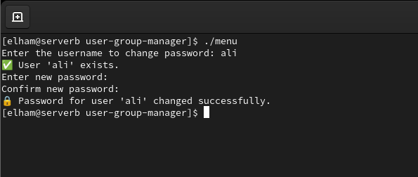

### 🔹 11. Exit:


### 🔹 12. Logs Operations File:
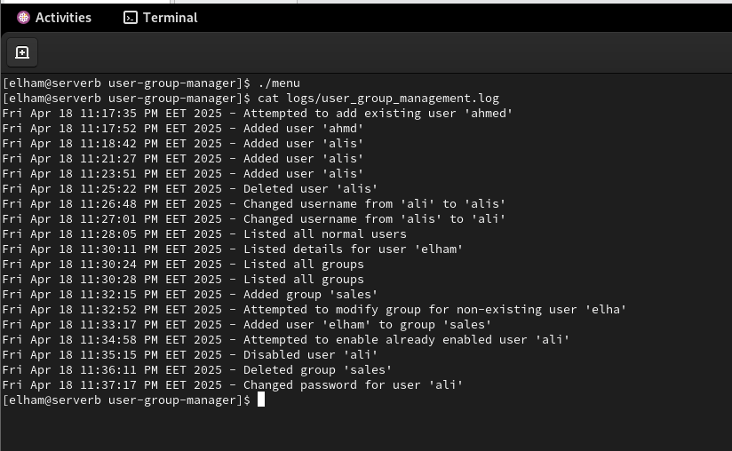

### 🎬 13. Demo Video of the Script:
[▶️ Click to View Demo Video](./screenshots/usergroupmanager.asf)

---

## 📄 Summary

**User-Group-Manager** is a powerful and interactive Bash script that simplifies user and group management on Linux systems using a user-friendly **Whiptail GUI**. It enables administrators to:

- Add / delete / modify users and groups  
- Enable or disable users  
- Log every action for auditing  
- Backup and restore users and groups  

💼 Great for:
- System administrators  
- DevOps engineers  
- Students learning Bash scripting

---

## 👨‍💻 Author Information

- **Name:** Elham Hasan Gouda Tammam Kedwany  
- **🔗 LinkedIn:** [linkedin.com/in/elham-hasan-6b029433a](https://www.linkedin.com/in/elham-hasan-6b029433a)  
- **💻 GitHub:** [github.com/elhamhassan90](https://github.com/elhamhassan90)


## 📸 Screenshots

### 🔹1. Main Menu:
   

### 🔹
2. Add User:
   

3. **Delete User**:
   

4. **Modify User**:
   

5. **List Users**:
   

6. **List a User and Groups**:
   

7. **Add & Modify a Group**:
   

8. **Enable & Disable a User**:
   

9. **Delete Group**:
   

10. **Change Password**:
   

11. **Exit**:
   

12. **Logs Operations File**:
   

### 13. Demo Video of the Script
📹 [Click to View Video](./screenshots/usergroupmanager.asf)

---

## 📄 Summary

**User-Group-Manager** is a powerful and interactive Bash script that simplifies user and group management on Linux systems using a user-friendly **Whiptail GUI**. It provides easy navigation to perform actions like adding, deleting, or modifying users and groups, with all activities logged for auditing and transparency.

✅ Ideal for:
- Linux system administrators  
- DevOps engineers  
- Students & professionals learning Bash scripting

🔧 Key Features:
- Whiptail-driven GUI menu  
- Logging every action  
- User & Group backup/restore  
- Lightweight & easy to integrate

---

## 👨‍💻 Author Information

- **👤 Name:** Elham Hasan Gouda Tammam Kedwany  
- **🔗 LinkedIn:** [linkedin.com/in/elham-hasan-6b029433a](https://www.linkedin.com/in/elham-hasan-6b029433a)  
- **💻 GitHub:** [github.com/elhamhassan90](https://github.com/elhamhassan90)

---


